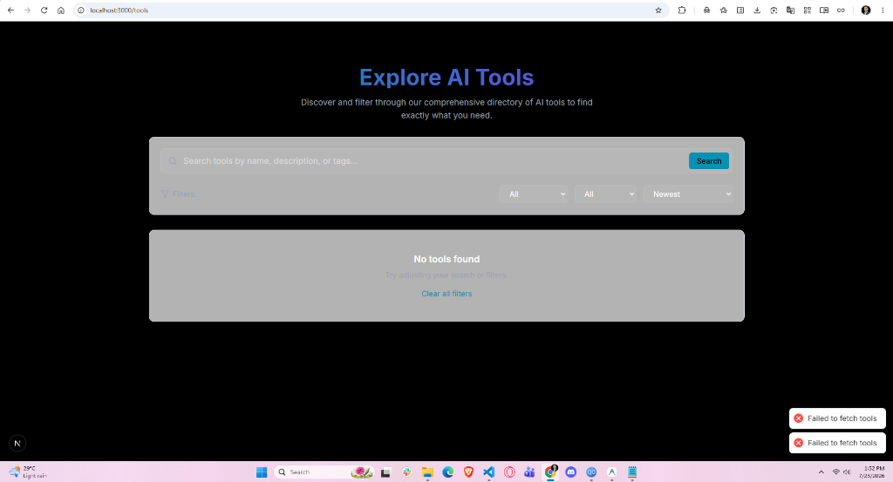
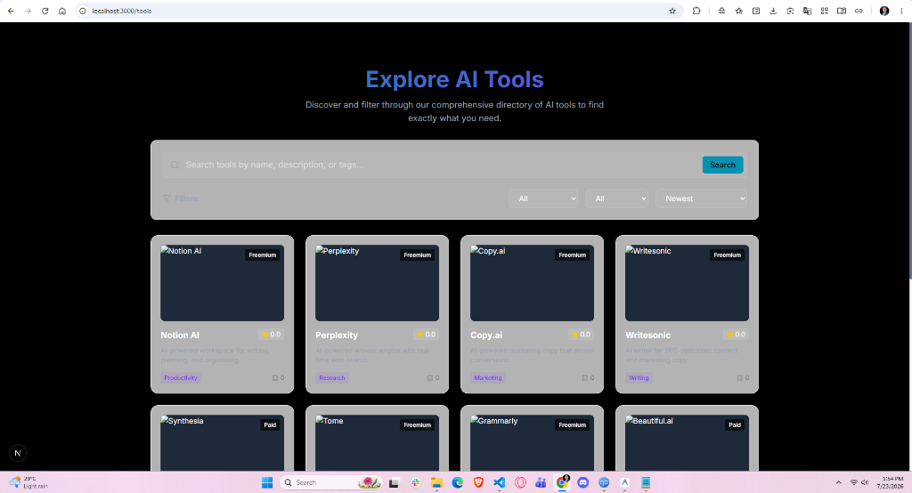
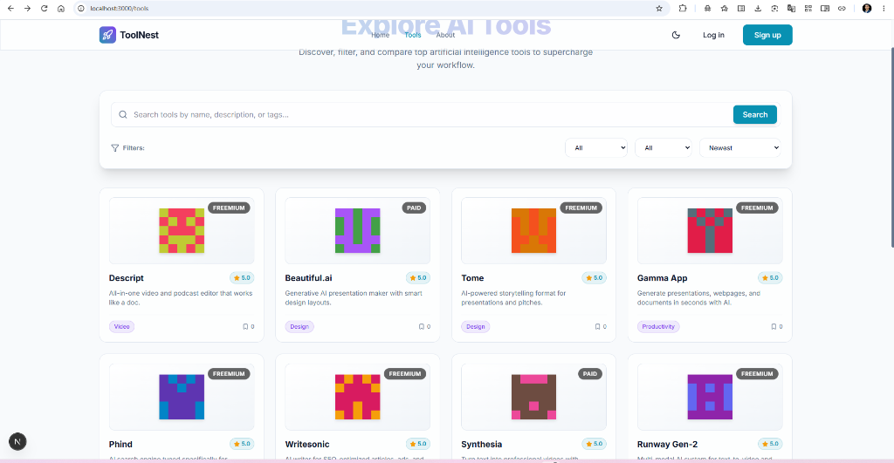
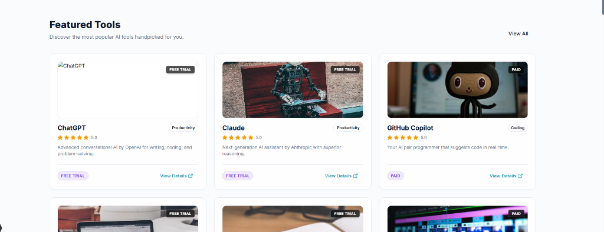
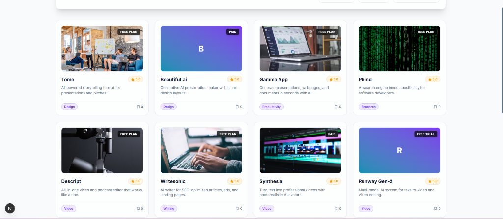

# 🚀 ToolNest Client — AI Tools Directory Platform

<div align="center">



### Discover, Compare, & Review 500+ Top AI Tools

[](https://tool-nest-client.vercel.app)
[](https://toolnest-server.onrender.com/api)
[](https://nextjs.org/)
[](https://www.typescriptlang.org/)
[](https://tailwindcss.com/)

---

### 👨‍💻 Connect with Developer (Atahar Shihab)

[](mailto:shihabatahar@gmail.com)
[](https://github.com/Atahar-Shihab)
[](https://www.linkedin.com/in/atahar-shihab)
[](https://www.facebook.com/atahar.shihab.740192/)

</div>

---

## 📸 Real Project Screenshots

<div align="center">

### 🏠 Landing Page & Hero Search


### 🔎 AI Tool Directory & Filters


### 📋 Detailed AI Tool View & AI Specifications


### 💳 Stripe Pro Membership Checkout


### 📊 Admin Analytics & Dashboard Overview


</div>

---

## 🌟 Key Features

### 🏠 Rich Landing Page & UI Aesthetics
- **Live Trending AI Tool Swiper**: Continuous 2-row infinite floating marquee showcasing trending AI tools with star ratings, pricing badges, and categories.
- **Responsive Mobile Non-Overlapping Search**: Intelligent hero search bar optimized for desktop, tablet, and mobile screens without text truncation.
- **Platform Analytics Banner**: Animated counter metrics showcasing 500+ AI Tools, 10,000+ Active Users, and 25,000+ Reviews.
- **Dark Glassmorphism UI**: Curated dark palette with subtle blur backdrop filters, glowing blur blobs, and smooth micro-animations.

### 🔍 Discovery & Detailed Metadata
- **Multi-Filter Tool Directory**: Filter by search keywords, category (*Writing, Coding, Design, Marketing, Productivity, Research, Video, Music*), pricing model (*Free Plan, Free Trial, Paid*), and sort order (*Newest, Highest Rated, Most Bookmarked, A-Z*).
- **AI Model & History Cards**: Tool detail pages display detailed AI specs:
  - 🤖 **AI Model**: e.g., *GPT-4o*, *Claude 3.5 Sonnet*, *Midjourney v6.1*, *Gen-3 Alpha*
  - 🏢 **Company Origin**: e.g., *OpenAI*, *Anthropic*, *Anysphere*, *Runway AI*
  - 📅 **Launch Year & History**: Historical background and founding story
- **Community Star Ratings & Reviews**: Real-time review submission with average score recalculation.
- **User Bookmarks**: One-click bookmark toggle saved to user profile.

### 📊 Comprehensive User & Admin Dashboards
- **User Dashboard**: Submit new tools, manage submitted applications, track reviews, and manage saved bookmarks.
- **Admin Management Suite**:
  - **Tool Moderation**: Approve or reject user-submitted tools with feedback.
  - **User Role Management**: Upgrade/downgrade user roles (`user` ↔ `admin`).
  - **Review Moderation**: Monitor and purge spam reviews.
  - **Analytics Charts**: Visual category distribution breakdown and platform metrics.

### 💳 Pro Membership & Payments
- **Stripe Integration**: One-time $5.00 lifetime Pro upgrade with 256-bit encrypted credit card processing via Stripe Elements.

---

## 🛠️ Technology Stack

- **Framework**: [Next.js 16 (App Router & Turbopack)](https://nextjs.org/)
- **Language**: [TypeScript](https://www.typescriptlang.org/)
- **Styling**: [Tailwind CSS v4](https://tailwindcss.com/) + Custom Glassmorphism System
- **Animations**: [Framer Motion](https://www.framer.com/motion/)
- **Icons**: [Lucide React](https://lucide.dev/)
- **Payments**: [@stripe/stripe-js](https://stripe.com/) & [@stripe/react-stripe-js](https://stripe.com/)
- **Authentication**: [@react-oauth/google](https://www.npmjs.com/package/@react-oauth/google) & Axios JWT Interceptor
- **Data Visualization**: [Recharts](https://recharts.org/)
- **Deployment**: [Vercel](https://vercel.com)

---

## 🚀 Getting Started

### 1. Prerequisites
- Node.js `v18.0.0` or higher
- npm `v9.0.0` or higher

### 2. Environment Variables Template (.env.local)
Create a `.env.local` file in your root folder:
```env
NEXT_PUBLIC_API_URL=https://toolnest-server.onrender.com/api
NEXT_PUBLIC_STRIPE_PUBLISHABLE_KEY=pk_test_your_stripe_publishable_key_here
NEXT_PUBLIC_GOOGLE_CLIENT_ID=your_google_client_id_here.apps.googleusercontent.com
```

### 3. Run Locally
```bash
npm install
npm run dev
```
Open [http://localhost:3000](http://localhost:3000) in your browser.

---

## 🔑 Demo Credentials

| Role | Email | Password | Access Rights |
| :--- | :--- | :--- | :--- |
| **Standard User** | `user@toolnest.com` | `User123!` | Submit tools, write reviews, bookmark tools, upgrade to Pro |
| **Admin User** | `admin@toolnest.com` | `Admin123!` | Full access + approve/reject tools, manage users, delete reviews, analytics |

---

## 📬 Contact & Support

Developed with ❤️ by **Atahar Shihab**:
- 📧 Email: [](mailto:shihabatahar@gmail.com)
- 🐙 GitHub: [](https://github.com/Atahar-Shihab)
- 💼 LinkedIn: [](https://www.linkedin.com/in/atahar-shihab)
- 📘 Facebook: [](https://www.facebook.com/atahar.shihab.740192/)

License: [MIT](LICENSE)
